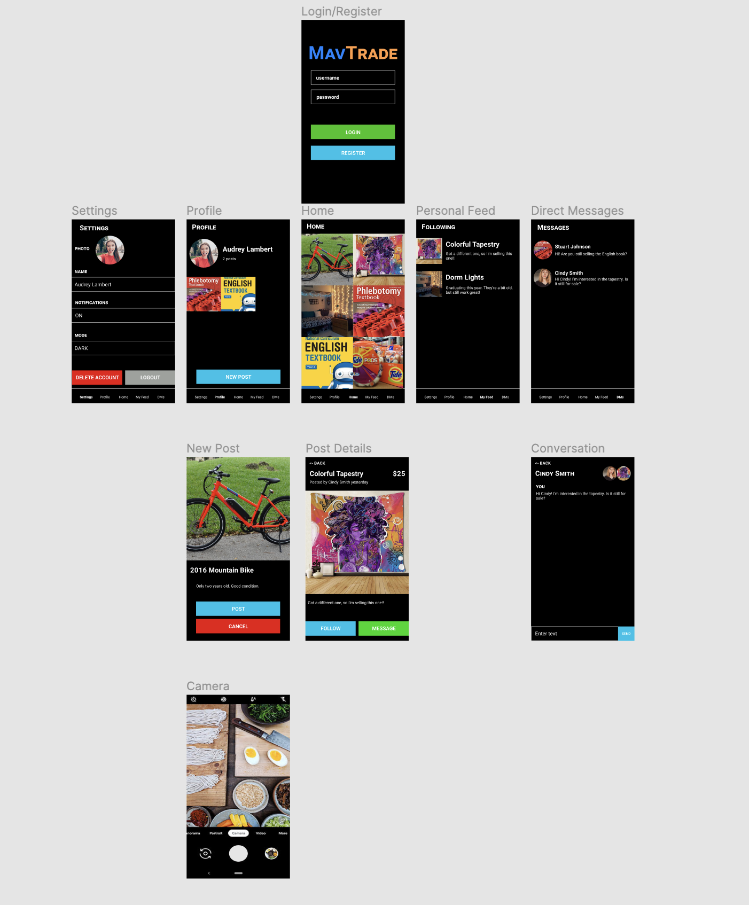
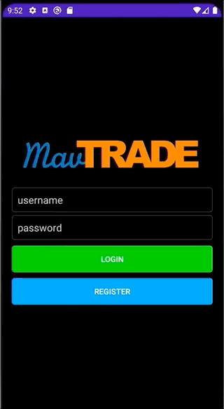

Unit 11: Group Milestone
===

# MavTrade

## Table of Contents
1. [Overview](#Overview)
1. [Product Spec](#Product-Spec)
1. [Wireframes](#Wireframes)
1. [Schema](#Schema)
1. [Progess Gifs](#Progress Gifs)

## Overview
### Description
MavTrade provides a user-friendly platform where UTA students can trade and sell their used books and goods. This app could be potentially used application similar to eBay where UTA students can share their opinions and trade stuff at the same time. 

### App Evaluation
- **Category:** Shopping, Social Networking
- **Mobile:** This app would be primarily developed for mobile but would perhaps be just as viable on a computer. Functionality wouldn't be limited to mobile devices, however mobile version could potentially have more features.
- **Story:** Users can post items and other users who get interested can contact the owner of the item through the application chat. They decide how they want to trade. 
- **Market:** Any UTA students or instructors could choose to use this app.
- **Habit:** This app could be used as often or unoften as the user wanted depending on how deep their social life is, and what exactly they're looking for.
- **Scope:** First we would start with posting items based on categories and provide a way to communicate each other, then perhaps this could evolve into a larger UTA community app.

## Product Spec
### 1. User Stories (Required and Optional)

**Required Must-have Stories**

- [x] User can register a new account
- [x] User can login
- [ ] User can create new item post
- [ ] User has profile page to see their posts
- [ ] User can see products posted
- [ ] Item shows availability
    - [ ] Open - Item has no ongoing deal.
    - [ ] Ongoing - Item is currently in the process of being sold.
    - [ ] Closed - Item is no longer available.

**Optional Nice-to-have Stories**

- [ ] User persistence
- [ ] Items have tags
- [ ] User can sort posts by time posted or price
- [ ] User can search items by keyword or tags
- [ ] Users can follow an item or save potential items
- [ ] Users can message seller/buyer about product
- [ ] Authorize user is a UTA student

### 2. Screen Archetypes

* Login 
* Register - User signs up or logs into their account
   * Upon Download/Reopening of the application, the user is prompted to log in to gain access to their profile information to be properly matched with another person. 
   * ...
* Messaging Screen - Chat for users to communicate (direct 1-on-1)
   * Providing messaging system for users
* Profile Screen 
   * Allows user to upload a photo and fill in information
* Posting Screen
   * Allows user to be able to choose their desired items, and add comments to the post.
* Sharing information Screen
   * Allow users to post random things that they want to share.

### 3. Navigation

**Tab Navigation** (Tab to Screen)

* Home
* Personal Freed
* Messages
* Profile
* Settings

**Flow Navigation** (Screen to Screen)
* Forced Log-in -> Account creation if no log in is available
* Home -> Posts -> Chat
* Profile -> Text field to be modified. 
* Settings -> Toggle settings

## Wireframes
 

https://www.figma.com/proto/2DwZmrxeP11xzKBXq8clXZ/MavTrade-Wireframes?node-id=1%3A3&scaling=scale-down&page-id=0%3A1

## Schema
### Models
#### Post
| Property | Type | Description |
| --- | --- | ---|
| objectId | String | unique id for the user post (default field) |
| createdAt | Date | date when post is created (default field) |
| updatedAt | Date | date when post is last updated (default field) |
| user | Pointer to User | post author |
| title | String | post title by author|
| image | File | image of item by author |
| description | String | post description by author |
| price | Number | item price by author |

### Network Requests
- Login screen
   - (Update/PUT) Create a new user object
- Home screen
   - (Read/GET) Query all posts sorted by most recent
- Create post screen
   - (Create/POST) Create a new post object
- Post Detail Screen
   - (Delete) Delete post object created by logged in user
- Profile screen
   - (Read/GET) Query all posts where user is author
   - (Read/GET) Query logged in user object
- Settings screen
   - (Update/PUT) Update user profile image
   - (Delete) Delete logged in user object

## Progress Gifs
### Unit 11

GIF created with [GIPHY](https://giphy.com/).
